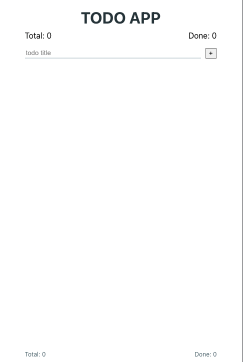

# react-work-sample-test

_This repo is used as a [work sample test](https://jacobian.org/series/work-sample-tests/) as part of hiring developers with a "front-end focus"._

## How we work

To make this work sample test as realistic and relevant as possible we provide you with aspects that are important for how we work at bettermarks:

- We consider adding tests as part of our work, and automating things is important for us.
- We encourage fast feedback loops, which can mean to show what is there, even if it's not "done" yet.
- We value frequent and open communication and learning from mistakes, including when we need to change our plans and things are not ready as fast as we anticipated.
- We are starting to use [conventional commits](https://www.conventionalcommits.org/en/v1.0.0/) in some repositories. But it's not a requirement for this test.

## How to do this work sample test

From our e-mail

> As the next step we ask you to do a work sample test, which you should not invest more than 2 hours for.

> Please try to finish the assignment within the next 7 days, if you need more time please let us know.

The next section contains some setup instructions to get you started.

After that we provide you with some acceptance criteria, describing how the app is supposed to work. This is what we have as part of our tickets before starting development.

Finally, we provide more details on how to submit your results.

**If there are any questions/problems while you are working on this, please ask them via mail or create an issue in the repo.**

## Setup

### 1. Configure the correct node version.

You can use [nvm](https://github.com/creationix/nvm#installation) (macOS/Linux) or [nvm-windows](https://github.com/coreybutler/nvm-windows#node-version-manager-nvm-for-windows) to switch Node versions between different projects.

Run `nvm i` or `nvm use` to install/use already installed node version specified in [`.nvmrc`](.nvmrc).

If you can not use `nvm` for some reason, make sure you have installed the node version specified in [`.nvmrc`](.nvmrc).

### 2. Install packages

To install packages, just run: `npm ci`

### 3. Start the backend

To start the "server", just run: `npm run start:server`.
(It needs to continue to run for the app to work.)

### 4. Start the frontend

To start the frontend - the react app - just run: `npm start`

It should open a browser window, and you should see:

### 5. Get familiar with the code base

- Get an overview over the existing code, libraries and tools this repo uses.
- Feel free to add a comment to code or even create a GitHub issue, when you have questions or concerns. You can of, course, also use those options to let us know about your understanding, assumptions or decisions.

**If there are any questions/problems while you are working on this, please ask them via mail or create an issue in the repo.**

## Acceptance criteria

### Scenario 1: Order todos by most recently created

When the user enters a todo into the input field and submits it:
- it should appear at the top of the list below the input field

When the user already has todos and the page is loaded,
- all todos are ordered from most recently created ones on the top to the first created one last

### Scenario 2: Marking a single todo as done

Given the user has already added todos

When the user clicks on the checkbox in front of a todo
- the checkbox should be checked
- and the text should be strikethrough (~~like this~~)
- and the "Done" counter (below the title and in the footer) should show the correct number
- and when reloading the page the todo is still marked as done

### Scenario 2b: Marking all todos as done

Given the user has already added todos (after scenario 1)

When the user clicks on the checkbox in front of the last todo that has not been marked as done
- the app should display a message to the user that reads
  "Congratulations, you're all set! You've done everything on your list."
- and when the user reloads the page the notification should not be shown again

### Scenario 3: Marking a todo as open

Given the user has already added todos and marked them as done (after scenario 2)

When the user clicks on the checkbox in front of a todo that has been marked as done
- the checkbox should no longer be checked
- the text of that todo should no longer be strikethrough
- and the "Done" counter (below the title and in the footer) should show the correct number
- and when reloading the page the todo is still marked as open

## Submit your results

From our e-mail

> Afterwards create a pull request with your results and ask me for a review.

> We will review your changes in a timely manner, and get back to you regarding the next step.

1. Commit and push all your changes to a new branch
2. Create a pull request on `main` with your results from GitHub
   In case you ar not familiar with creating pull requests, please follow [the official instructions provided by GitHub](https://docs.github.com/en/pull-requests/collaborating-with-pull-requests/proposing-changes-to-your-work-with-pull-requests/creating-a-pull-request).
3. Add your contact person as a reviewer.
